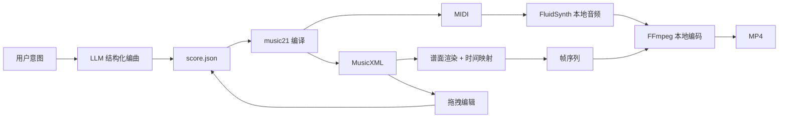

# 架构设计（Architecture V1.0）

## 1. 架构目标

1. 保证本地渲染闭环：`MusicXML/MIDI -> WAV -> MP4`。
2. 保证可编辑闭环：`生成 -> 编辑 -> 重渲染 -> 导出`。
3. 保证风格扩展性：风格仅在策略层生效。

## 2. 系统分层

1. 展示层：桌面 UI（项目管理、参数输入、谱面拖拽、导出）。
2. 应用层：本地编排协调器（任务编排、重试、版本管理）。
3. 领域层：编曲计划、乐谱模型、风格配置、校验规则。
4. 基础设施层：music21、FluidSynth、FFmpeg、谱面渲染引擎。

## 3. 核心流程

## 4. 模块边界

### 4.1 Desktop UI

1. 输入：用户意图参数、拖拽事件。
2. 输出：任务请求、导出请求。
3. 不负责：音频/视频渲染逻辑。

### 4.2 Orchestrator

1. 输入：任务请求（生成、编辑、重渲染、导出）。
2. 输出：状态更新、版本化产物。
3. 负责：任务依赖排序、失败重试、日志记录。

### 4.3 Composition Engine

1. 输入：意图 + 风格配置。
2. 输出：结构化编曲计划（JSON）。

### 4.4 Score Compiler

1. 输入：结构化编曲 JSON。
2. 输出：MusicXML、MIDI。

### 4.5 Local Renderers

1. 音频：MIDI + SoundFont -> WAV。
2. 视频：MusicXML + time map + WAV -> MP4。

## 5. 风格层设计

1. `StyleProfile` 以配置形式注入，不改底层渲染流程。
2. MVP 默认启用 `ancient_cn`。
3. 用户自定义风格走同样编译与渲染链路。

## 6. 可靠性设计

1. 生成失败可重试：最多 3 次。
2. 渲染失败可重试：最多 2 次。
3. 每次保存编辑创建新版本，支持回滚。

## 7. 可观测性

1. 任务级日志：`task_id / project_id / stage / duration / status`。
2. 产物级日志：文件路径、哈希、版本号。
3. 关键指标：成功率、平均渲染耗时、音画偏差。

