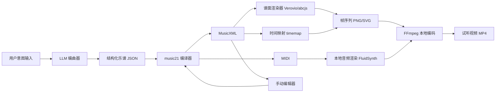

# Piano for AI 自动编曲系统 PRD（V0.1）

- 版本：V0.1（研究与立项版）
- 日期：2026-03-01
- 目标用户：内容创作者、音乐教育场景、独立音乐人
- 关键约束：音频与视频均必须本地渲染，不依赖云端渲染

## 1. 产品目标

构建一个可落地的 AI 自动编曲产品，满足以下核心能力：

1. 用户输入意图后，系统用 LLM 快速生成简谱和五线谱。
2. 后端根据乐谱生成可试听音频（MVP 先支持钢琴）。
3. 自动生成“乐谱播放进度视频”：播放过的音符/区域变黑，未播放区域淡灰。
4. 支持用户手动微调乐谱并重新渲染。

## 2. 范围定义

### 2.1 MVP 范围（本期）

1. 单乐器：钢琴。
2. 速度优先：30-60 秒短曲可在可接受时间内完成全链路渲染。
3. 输出格式：
   - 乐谱：MusicXML（主）、简谱文本（辅助）
   - 音频：WAV（主），可转 MP3
   - 视频：MP4（H.264）
4. 手动编辑支持：音高、时值、力度、速度（BPM）基础编辑。

### 2.2 非目标（MVP 暂不做）

1. 多乐器自动配器（弦乐、鼓组、管乐）。
2. 实时多人协作编辑。
3. 移动端完整编辑器。

## 3. 核心需求（功能）

### FR-1 AI 编曲与乐谱生成

1. 输入：风格、情绪、时长、速度、调式、难度、参考曲风。
2. 输出：
   - 简谱（便于快速查看）
   - 五线谱（MusicXML）
3. 失败兜底：当 LLM 输出不合规时，进入结构化纠错与二次生成。

### FR-2 本地音频渲染

1. 输入：MIDI 或 MusicXML 转换后的 MIDI。
2. 渲染：本地 SoundFont 合成（MVP：钢琴音色）。
3. 输出：WAV。
4. 约束：不调用云端 TTS/音乐生成作为最终渲染链路。

### FR-3 本地视频渲染（进度高亮）

1. 输入：乐谱（MusicXML）+ 时间映射（note id -> 时间）。
2. 逻辑：
   - 已播放音符：黑色
   - 未播放音符：淡灰
3. 输出：MP4，并与本地合成音频对齐。
4. 约束：不调用云端视频生成服务作为主渲染链路。

### FR-4 手动微调

1. 编辑项：音高、时值、力度、节拍、速度。
2. 编辑后支持一键重渲染音频和视频。
3. 保留版本历史（至少最近 N 次）。

## 4. 技术方案（MVP 建议）

## 4.1 架构总览

## 4.2 关键实现决策

1. 统一交换格式使用 MusicXML。
2. 组合生成层用 LLM 输出“结构化 JSON + 约束规则”，再由 `music21` 生成 MusicXML/MIDI，降低直接吐乐谱文本的错误率。
3. 音频渲染采用 `FluidSynth + SoundFont` 本地合成，保证离线可用和可控音色。
4. 视频渲染采用“本地帧渲染 + FFmpeg 合成”而非云端视频模型。
5. 手动编辑优先实现“参数级编辑 + 可视化回显”，后续再增强到拖拽谱面编辑。

## 5. GitHub 案例与可借鉴实践

> 以下 star 与更新时间来自 2026-03-01 的 GitHub API 快照。

| 案例 | 相关能力 | 可借鉴点 | 风险/限制 |
|---|---|---|---|
| `cuthbertLab/music21`（2431⭐） | MusicXML/MIDI 读写与算法处理 | 用作乐谱编译与规则校验核心 | Python 生态，需与前端渲染层衔接 |
| `rism-digital/verovio`（824⭐） | 乐谱排版、MusicXML 支持、timemap | 可生成时间映射用于“已播放变黑” | 主要是渲染/排版，非完整编辑器 |
| `paulrosen/abcjs`（2224⭐） | 浏览器端乐谱显示、交互编辑、时序回调 | 可用于前端微调与播放回调 | 以 ABC 为中心，与 MusicXML 需转换策略 |
| `FluidSynth/fluidsynth`（2297⭐） | 本地 MIDI->音频合成 | 满足“本地音频渲染”硬约束 | 音色依赖 SoundFont 质量 |
| `CarlGao4/mscz-to-video`（14⭐） | 乐谱转视频流水线 | 证明“本地乐谱视频”可行路径 | 工程成熟度一般，需重构为服务化 |
| `facebookresearch/audiocraft`（23026⭐） | AI 音乐生成（MusicGen） | 可作为后续“音频先行生成”路线 | 与符号级乐谱控制耦合较弱 |
| `spotify/basic-pitch`（4724⭐） | 音频转 MIDI | 可做“哼唱/参考音频转谱”扩展 | 不是直接编曲器 |
| `opensheetmusicdisplay/opensheetmusicdisplay`（1797⭐） | Web 乐谱显示 | 可做只读展示层 | 官方说明不支持播放与交互编辑 |

## 6. 互联网案例与实现观察

1. Soundslice：核心体验是音频与谱面同步、可视化跟随，验证“进度驱动谱面高亮”场景价值高。
2. Suno / AIVA：验证“文本到音乐”需求强，但其主要输出是音频，不天然满足“可编辑五线谱”场景。
3. MusicXML 4.0（W3C 社区规范）：适合作为跨工具的乐谱交换标准。
4. FFmpeg：可稳定完成本地图像序列与音频的合成编码，适合离线生产流水线。

## 7. 本地渲染链路（满足你的新增要求）

### 7.1 音频本地渲染链

1. `MusicXML -> MIDI`（music21）
2. `MIDI + piano.sf2 -> WAV`（FluidSynth）
3. 可选：`WAV -> MP3`（FFmpeg）

### 7.2 视频本地渲染链

1. 使用 Verovio 渲染乐谱页面（SVG/Canvas）
2. 使用 timemap 获取 note 与时间对应关系
3. 按时间轴批量渲染帧：已播放黑色、未播放灰色
4. `帧序列 + WAV -> MP4`（FFmpeg image2 + 编码）

## 8. MVP 里程碑建议

1. 里程碑 A（1 周）：完成结构化编曲输出（JSON -> MusicXML/MIDI）。
2. 里程碑 B（1 周）：完成本地音频渲染（可试听）。
3. 里程碑 C（1 周）：完成本地谱面进度视频渲染。
4. 里程碑 D（1 周）：完成手动微调与一键重渲染。

## 9. 风险与规避

1. LLM 乐谱格式不稳定。
   - 规避：LLM 仅输出结构化 JSON，渲染层统一编译。
2. 视觉谱面与音频时间漂移。
   - 规避：统一以 MIDI ticks/time map 为真值。
3. 手动编辑复杂度高。
   - 规避：MVP 先做基础编辑项，避免一次性做完整排版编辑器。
4. 本地渲染性能。
   - 规避：限制分辨率和时长，批处理帧并行渲染。

## 10. 待确认项（确认后输出 SOP 与 SPEC）

1. MVP 单曲时长上限：30 秒 / 60 秒 / 120 秒？
2. 优先风格：流行钢琴、古典钢琴、Lo-fi、影视配乐，先做哪 2 类？
3. 手动微调交互优先级：
   - A：参数面板编辑（快上线）
   - B：谱面拖拽编辑（体验更好）
4. 部署形态：本地桌面优先，还是 Web + 本地渲染服务？
5. 是否需要“导出 MIDI + MusicXML + MP4”作为首版交付标准？

## 11. 参考来源

### GitHub

- https://github.com/cuthbertLab/music21
- https://www.music21.org/music21docs/about/what.html
- https://github.com/rism-digital/verovio
- https://book.verovio.org/toolkit-reference/output-formats.html
- https://book.verovio.org/interactive-notation/using-the-timemap.html
- https://github.com/paulrosen/abcjs
- https://docs.abcjs.net/interactive/interactive-editor
- https://docs.abcjs.net/visual/dragging
- https://docs.abcjs.net/animation/timing-callbacks
- https://github.com/FluidSynth/fluidsynth
- https://github.com/CarlGao4/mscz-to-video
- https://github.com/facebookresearch/audiocraft
- https://github.com/spotify/basic-pitch
- https://github.com/opensheetmusicdisplay/opensheetmusicdisplay
- https://raw.githubusercontent.com/opensheetmusicdisplay/opensheetmusicdisplay/develop/README.md

### 互联网案例/规范/工具

- https://www.soundslice.com/help/en/player/advanced/20/visual-keyboard/
- https://suno.com/hub/how-to-make-a-song
- https://help.suno.com/en/articles/6141505
- https://www.aiva.ai/music/
- https://www.w3.org/2021/06/musicxml40/
- https://ffmpeg.org/ffmpeg-all.html
