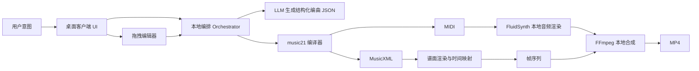

# Piano for AI 技术规格说明（SPEC V1.0）

- 版本：V1.0
- 日期：2026-03-01
- 状态：已根据需求确认项冻结（MVP）

## 1. 已确认需求（冻结项）

1. MVP 单曲上限时长：60 秒。
2. 优先风格：古风（同时支持用户自定义风格输入）。
3. 手动微调优先级：谱面拖拽编辑优先。
4. 部署形态：桌面本地优先。
5. 导出要求：必须导出 `MusicXML + MIDI + MP4`。
6. 渲染约束：音频与视频均本地渲染，不使用云端渲染链路。

## 2. 架构原则

1. 核心管线风格无关：`编曲结构 -> 乐谱编译 -> 本地音频 -> 本地视频` 固定。
2. 风格作为策略层：通过模板和约束影响“生成内容”，不改动“渲染机制”。
3. 全链路可追踪：每次生成、编辑、渲染都有版本号和元数据。
4. 可离线运行：除 LLM 调用外，其余编译与渲染在本地完成。

## 3. 总体架构



## 4. 模块规格

## 4.1 桌面客户端（Desktop App）

1. 职责：参数输入、谱面展示、拖拽编辑、任务进度与导出。
2. 必需能力：
   - 工程管理（新建/打开/保存）
   - 拖拽编辑事件捕获（音高、时值）
   - 渲染任务状态（排队、执行、失败重试）

## 4.2 编排协调器（Local Orchestrator）

1. 职责：串联生成、编译、渲染、导出。
2. 输入：`intent.json` 或编辑后的 `score.json`。
3. 输出：版本化产物与 `manifest.json`。
4. 重试策略：
   - LLM 失败：最多 3 次
   - 渲染失败：最多 2 次

## 4.3 乐谱编译器（music21）

1. 输入：结构化编曲 JSON。
2. 输出：`MusicXML`、`MIDI`。
3. 校验规则：
   - 小节时值闭合
   - 音符合法音域
   - 调式与拍号一致

## 4.4 音频渲染器（FluidSynth）

1. 输入：`MIDI + piano.sf2`。
2. 输出：`WAV`（48kHz，16-bit，立体声，MVP 默认）。
3. 约束：必须为本地合成，不允许云端替代。

## 4.5 视频渲染器（Score Frames + FFmpeg）

1. 输入：`MusicXML + 时间映射 + WAV`。
2. 规则：已播放音符黑色，未播放淡灰。
3. 输出：`MP4 (H.264 + AAC)`。
4. 同步目标：音画偏差 <= 80ms。

## 4.6 拖拽编辑器（优先功能）

1. 最小功能：
   - 拖拽音符改变音高
   - 操作后重算小节合法性
2. 数据一致性：
   - UI 拖拽后必须回写 `score.json`
   - 仅视觉变化不算有效编辑

## 5. 数据模型（MVP）

## 5.1 IntentInput

```json
{
  "title": "string",
  "style": "ancient_cn | custom",
  "mood": "string",
  "tempo_bpm": 96,
  "key": "C | D | ...",
  "duration_sec": 60,
  "difficulty": "easy | medium | hard",
  "reference": "string"
}
```

## 5.2 CompositionPlan（LLM 输出）

```json
{
  "meta": { "time_signature": "4/4", "bars": 32 },
  "sections": [
    {
      "name": "A",
      "bars": [1, 8],
      "motif_rules": ["pentatonic_bias", "stepwise_motion"]
    }
  ],
  "notes": [
    {
      "bar": 1,
      "beat": 1.0,
      "pitch": "A4",
      "dur": "1/8",
      "vel": 72
    }
  ]
}
```

## 5.3 Project Manifest

```json
{
  "project_id": "uuid",
  "version": "v003",
  "exports": {
    "musicxml": "exports/song_v003.musicxml",
    "midi": "exports/song_v003.mid",
    "mp4": "exports/song_v003.mp4"
  },
  "checksum": {
    "musicxml": "sha256",
    "midi": "sha256",
    "mp4": "sha256"
  }
}
```

## 6. 风格策略设计（回答“风格是否影响架构”）

结论：风格会影响“生成策略与质量评估”，但不应影响“底层渲染架构”。

1. 不影响架构的部分：
   - MusicXML/MIDI 编译流程
   - 本地音频合成流程
   - 本地视频编码流程
2. 会影响的部分：
   - LLM 提示词和约束（如古风偏五声调式、句法倾向）
   - 模板库（古风 motif、终止式模板）
   - 自动评估规则（风格一致性打分）
3. 工程实现：
   - 新增 `StyleProfile` 配置层
   - MVP 内置 `ancient_cn`
   - 用户仍可输入任意风格，系统先尝试自由生成；质量不足时回退到模板增强

## 7. 渲染管线规范

1. `score.json -> music21 -> song.musicxml + song.mid`
2. `song.mid -> FluidSynth -> song.wav`
3. `song.musicxml -> 渲染帧序列 + 时间映射`
4. `frames + song.wav -> FFmpeg -> song.mp4`
5. 导出 `song.musicxml + song.mid + song.mp4`

## 8. 非功能要求（NFR）

1. 可用性：MVP 成功率 >= 95%（有效输入下）。
2. 性能：60 秒曲目全链路在目标设备可完成（需记录基准机）。
3. 可维护性：模块化，风格策略可独立扩展。
4. 可审计性：每次生成与编辑都有日志和版本。

## 9. 验收标准（Acceptance Criteria）

1. 输入意图后可稳定生成可播放乐谱，并能导出三种必需文件。
2. 拖拽编辑后，音频和视频可正确重渲染并保持同步。
3. 导出的 `MusicXML` 和 `MIDI` 可在常见工具中打开。
4. 无云端渲染依赖时，系统仍可完成本地音频与视频产出。

## 10. 出范围项（MVP）

1. 多乐器自动配器。
2. 实时协同编辑。
3. 云端渲染集群优化。

## 11. 交付物

1. 桌面客户端可执行程序（本地优先）。
2. 编排与渲染本地服务。
3. 三类导出产物：`MusicXML + MIDI + MP4`。
4. 项目文档：PRD、SOP、SPEC。

